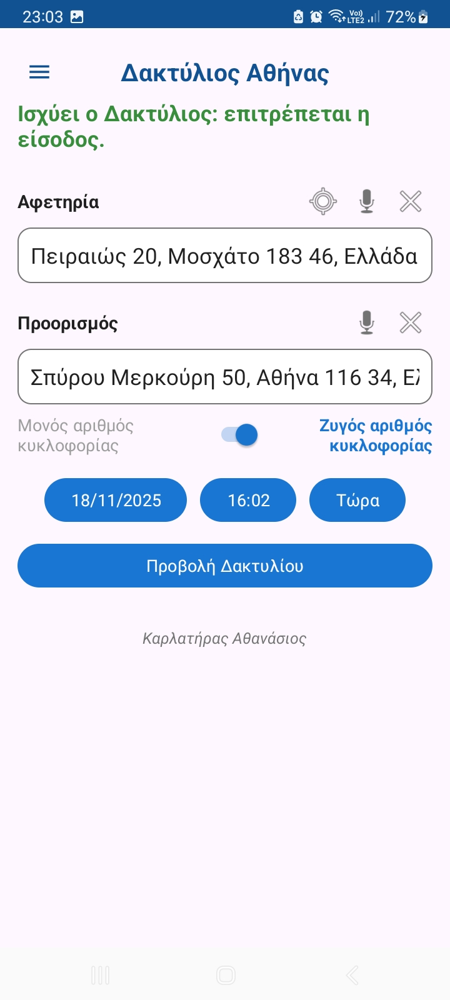
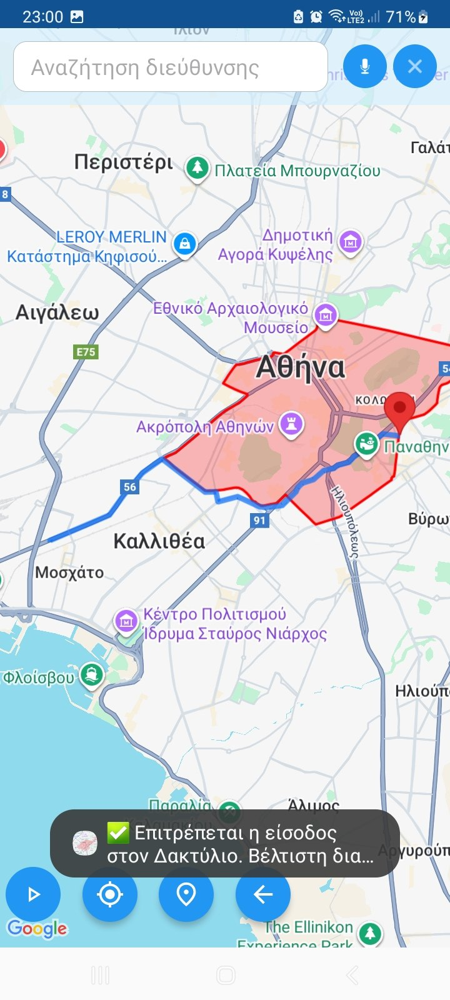
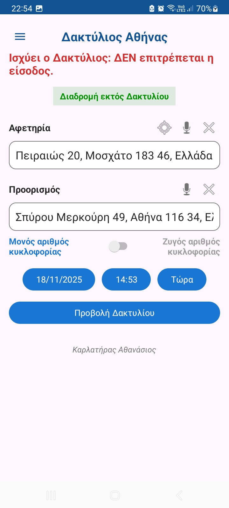
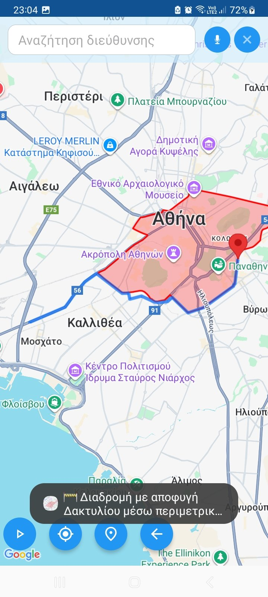
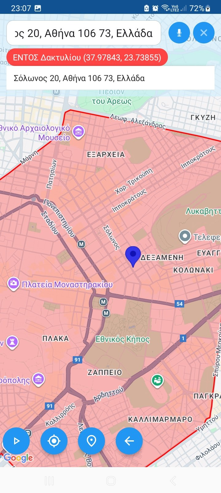
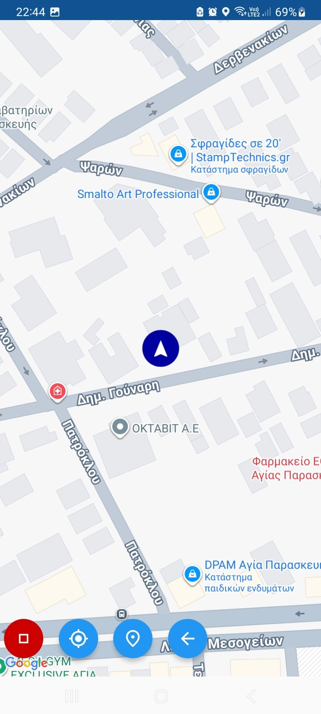

# 🟥 AthensRingHelper  
### Android app for navigating the *Athens Ring* (Δακτύλιος Αθήνας)

AthensRingHelper is a practical Android application that helps drivers understand and navigate the **Athens Traffic Ring (Δακτύλιος Αθήνας)**.  
It checks real-time entry permissions based on the vehicle’s plate parity, date/time rules, and current location, and provides optimized routes either **inside the Ring** (when allowed) or **around it** (when not allowed).

---

## 📥 Download APK  
The latest stable APK is available under **GitHub Releases**:

➡️ **https://github.com/a-karlatiras/AthensRingHelper/releases**

---

# 🚀 Features

### ✔ Ring entry check (Μονά–Ζυγά)
- Real-time validation based on the official rules.
- Supports manual or automatic (GPS-based) time selection.

### ✔ Route calculation
- **When entry is allowed** → shows best route through the Ring.  
- **When entry is NOT allowed** → calculates a detour around the Ring.

### ✔ Interactive map
- Fully visualized Ring polygon (red boundary + translucent fill).
- Instant notifications when inside or near restricted areas.
- Real-time movement tracking (without voice navigation).

### ✔ Points of interest
- Check any address and see if it lies **inside or outside** the Athens Ring.

---

# 📸 Screenshots

> Τα αρχεία εικόνων πρέπει να ανέβουν στον φάκελο `screenshots/` μέσα στο repository.  
> Στη συνέχεια απλώς αντικατέστησε τα filenames παρακάτω.

---

### 🖼️ 1. Αρχική οθόνη – Επιτρέπεται η είσοδος
Η εφαρμογή εμφανίζει αν ο δακτύλιος ισχύει και αν επιτρέπεται η είσοδος του οχήματος με βάση τον αριθμό κυκλοφορίας.

---

### 🖼️ 2. Βέλτιστη διαδρομή εντός Δακτυλίου  
Ο χάρτης δείχνει ότι η καλύτερη διαδρομή περνά μέσα από τον Δακτύλιο και εμφανίζεται σχετική ειδοποίηση.

---

### 🖼️ 3. Αρχική οθόνη – Δεν επιτρέπεται η είσοδος  
Ο δακτύλιος ισχύει αλλά το όχημα **δεν** μπορεί να εισέλθει (παράδειγμα: ζυγός αριθμός κυκλοφορίας σε ημέρα μονών).

---

### 🖼️ 4. Διαδρομή εκτός Δακτυλίου  
Όταν δεν επιτρέπεται η είσοδος, ο αλγόριθμος υπολογίζει αυτόματα περιμετρική διαδρομή.

---

### 🖼️ 5. Έλεγχος αν μια διεύθυνση βρίσκεται εντός Δακτυλίου  
Η εφαρμογή μπορεί να χρησιμοποιηθεί σαν εργαλείο γρήγορης αναζήτησης διεύθυνσης.

---

### 🖼️ 6. Πλοήγηση σε πραγματικό χρόνο  
Καθώς κινείται το όχημα:
- Αν πλησιάζει στα όρια του Δακτυλίου → εμφανίζει ειδοποίηση 6 δευτ.  
- Αν μπει μέσα ενώ δεν επιτρέπεται → εμφανίζει διαρκές προειδοποιητικό μήνυμα.

---

# 🇬🇷 Περιγραφή στα Ελληνικά

Το **AthensRingHelper** είναι μια Android εφαρμογή που βοηθάει τους οδηγούς να γνωρίζουν αν επιτρέπεται ή όχι η είσοδος του οχήματός τους στον **Δακτύλιο της Αθήνας**, ανάλογα με:

- τον αριθμό κυκλοφορίας (μονός–ζυγός)  
- την ημέρα και ώρα  
- τη διαδρομή που έχουν επιλέξει  

Η εφαρμογή υπολογίζει είτε:
- **τη βέλτιστη διαδρομή εντός του Δακτυλίου**, όταν επιτρέπεται η είσοδος,  
ή  
- **διαδρομή εκτός Δακτυλίου**, όταν δεν επιτρέπεται.

Επιπλέον, προσφέρει:
- πλοήγηση σε πραγματικό χρόνο  
- εργαλεία ελέγχου διευθύνσεων  
- άμεσες ειδοποιήσεις εντός/εκτός Δακτυλίου  

---

# 🔍 Keywords (SEO)

Αυτές οι λέξεις βοηθούν στη βελτίωση των ελληνικών αναζητήσεων:

